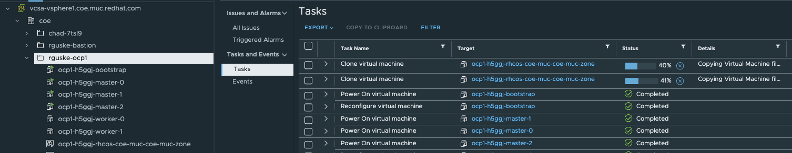
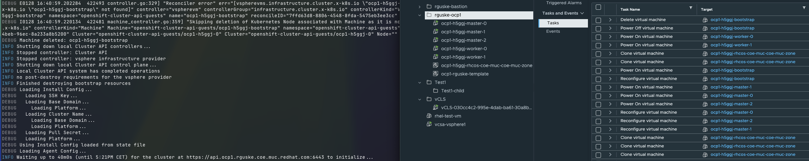

# Red Hat OpenShift Installation - Installer Provisioned Infrastructure (IPI)

You can install OpenShift Container Platform on vSphere by using installer-provisioned infrastructure. Installer-provisioned infrastructure allows the installation program to preconfigure and automate the provisioning of resources required by OpenShift Container Platform. Installer-provisioned infrastructure is useful for installing in environments with disconnected networks, where the installation program provisions the underlying infrastructure for the cluster.


## Preperations

Setup a Bastion Host using e.g RHEL9.

### SSH

`cat ~/.ssh/id_ed25519.pub | ssh rguske@rguske-bastion.rguske.coe.muc.redhat.com "mkdir -p ~/.ssh && cat >> ~/.ssh/authorized_keys && chmod 600 ~/.ssh/authorized_keys && chmod 700 ~/.ssh"`

* Generating an SSH key pair on your Bastion-Host. You can use this key pair to authenticate into the OpenShift Container Platform cluster’s nodes after it is deployed.

`ssh-keygen -t ed25519 -N '' -f ~/.ssh/id_ed25519`

### RHEL Subscription Manager

* Register the `subscription-manager`: `sudo subscription-manager register --username  --password `

### vCenter Root Certificates

* [Adding your vCenter’s trusted root CA certificates](https://docs.redhat.com/en/documentation/openshift_container_platform/4.17/html/installing_on_vmware_vsphere/installer-provisioned-infrastructure#installation-adding-vcenter-root-certificates_ipi-vsphere-preparing-to-install) to your system trust.
* Downloading and adding the certificates: `curl -kLO https://vcsa-vsphere1.coe.muc.redhat.com/certs/download.zip`
* Install `unzip` to unpack the zip file: `sudo dnf install unzip -y`.
* Unpack the zip file: `unzip download.zip`.
* Move the certificates to the system trust: `cp certs/lin/* /etc/pki/ca-trust/source/anchors`
* Update your system trust: `update-ca-trust extract`

### Installing necessary CLIs

On the bastion host, download the necessary cli's:

`curl -LO <url>`

* [openshift-install-rhel9](https://mirror.openshift.com/pub/openshift-v4/clients/ocp/4.17.6/openshift-install-rhel9-amd64.tar.gz)
* [openshift-client-linux-amd64](https://mirror.openshift.com/pub/openshift-v4/clients/ocp/4.17.6/openshift-client-linux-amd64-rhel9-4.17.6.tar.gz)

Unpack the `.gz`files and copy them into your path:

If /usr/local/bin isn't included in the $PATH, run
`export PATH=/usr/local/bin:$PATH`

```shell
cp openshift-install /usr/local/bin/
cp oc /usr/local/bin/
cp kubectl /usr/local/bin/
```

### Create local config - IPI

Create the installation configuration for OCP interactively by executing: `openshift-install create install-config --dir .`

```shell
openshift-install create install-config --dir .
? SSH Public Key /home/rguske/.ssh/id_rsa.pub
? Platform vsphere
? vCenter vcsa-vsphere1.coe.muc.redhat.com
? Username administrator@vsphere.local
? Password [? for help] ********
INFO Connecting to vCenter vcsa-vsphere1.coe.muc.redhat.com
INFO Defaulting to only available datacenter: coe
INFO Defaulting to only available cluster: /coe/host/cluster
? Default Datastore /coe/datastore/shared-netapp
INFO Defaulting to only available network: VM Network
? Virtual IP Address for API 10.32.96.120
? Virtual IP Address for Ingress 10.32.96.121
? Base Domain rguske.coe.muc.redhat.com
? Cluster Name ocp1
? Pull Secret [? for help] ****************************************************************************************************************************************************************************************
INFO Install-Config created in: .
```

Output `install-config.yaml`:

```yaml
additionalTrustBundlePolicy: Proxyonly
apiVersion: v1
baseDomain: rguske.coe.muc.redhat.com
compute:
- architecture: amd64
  hyperthreading: Enabled
  name: worker
  platform: {}
  replicas: 3
controlPlane:
  architecture: amd64
  hyperthreading: Enabled
  name: master
  platform: {}
  replicas: 3
metadata:
  creationTimestamp: null
  name: ocp1
networking:
  clusterNetwork:
  - cidr: 10.128.0.0/14
    hostPrefix: 23
  machineNetwork:
  - cidr: 10.0.0.0/16
  networkType: OVNKubernetes
  serviceNetwork:
  - 172.30.0.0/16
platform:
  vsphere:
    apiVIPs:
    - 10.32.96.120
    failureDomains:
    - name: generated-failure-domain
      region: generated-region
      server: vcsa-vsphere1.coe.muc.redhat.com
      topology:
        computeCluster: /coe/host/cluster
        datacenter: coe
        datastore: /coe/datastore/shared-netapp
        networks:
        - VM Network
        resourcePool: /coe/host/cluster/Resources
      zone: generated-zone
    ingressVIPs:
    - 10.32.96.121
    vcenters:
    - datacenters:
      - coe
      password: R3dH4t1!
      port: 443
      server: vcsa-vsphere1.coe.muc.redhat.com
      user: administrator@vsphere.local
publish: External
pullSecret: '{"auths":{"cloud.openshift.com":{"auth":"b3BlbnNoaWZ0LXJlbG...'
sshKey: |
  ssh-rsa AAAAB3N...
```

This is pretty similiar to what you've might know from the [Agent-Based-Installer](https://github.com/rguske/openshift-agent-based-installer?tab=readme-ov-file#configurations), except the part `failureDomains`. Furthermore, the output expects a DHCP supported environment. I'd like to configure it with static IPs.

Samle configuration with static IP assignments:

```yaml
cat > install-config.yaml <<EOF
additionalTrustBundlePolicy: Proxyonly
apiVersion: v1
baseDomain: rguske.coe.muc.redhat.com
compute:
- architecture: amd64
  hyperthreading: Enabled
  name: worker
  platform: {}
  replicas: 2
controlPlane:
  architecture: amd64
  hyperthreading: Enabled
  name: master
  platform: {}
  replicas: 3
metadata:
  creationTimestamp: null
  name: ocp1
networking:
  clusterNetwork:
  - cidr: 10.128.0.0/14
    hostPrefix: 23
  machineNetwork:
  - cidr: 10.32.96.0/20
  networkType: OVNKubernetes
  serviceNetwork:
  - 172.30.0.0/16
platform:
  vsphere:
    hosts:
    - role: bootstrap
      networkDevice:
        ipAddrs:
        - 10.32.96.127/20
        gateway: 10.32.111.254
        nameservers:
        - 10.32.96.1
    - role: control-plane
      networkDevice:
        ipAddrs:
        - 10.32.96.122/20
        gateway: 10.32.111.254
        nameservers:
        - 10.32.96.1
    - role: control-plane
      networkDevice:
        ipAddrs:
        - 10.32.96.123/20
        gateway: 10.32.111.254
        nameservers:
        - 10.32.96.1
    - role: control-plane
      networkDevice:
        ipAddrs:
        - 10.32.96.124/20
        gateway: 10.32.111.254
        nameservers:
        - 10.32.96.1
    - role: compute
      networkDevice:
        ipAddrs:
        - 10.32.96.125/20
        gateway: 10.32.111.254
        nameservers:
        - 10.32.96.1
    - role: compute
      networkDevice:
        ipAddrs:
        - 10.32.96.126/20
        gateway: 10.32.111.254
        nameservers:
        - 10.32.96.1
    apiVIPs:
    - 10.32.96.120
    failureDomains:
    - name: failure-domain-1
      region: coe-muc
      server: 'vcsa-vsphere1.coe.muc.redhat.com'
      topology:
        computeCluster: /coe/host/cluster
        datacenter: coe
        datastore: /coe/datastore/shared-netapp
        networks:
        - VM Network
        folder: /coe/vm/rguske-ocp1
      zone: coe-muc-zone
    ingressVIPs:
    - 10.32.96.121
    vcenters:
    - datacenters:
      - coe
      password: 'R3dH4t1!'
      port: 443
      server: 'vcsa-vsphere1.coe.muc.redhat.com'
      user: 'administrator@vsphere.local'
publish: External
pullSecret: '{"auths":{"cloud.openshift.com":{"auth":"b3BlbnNoaWZ0LXJlbGVhc2UtZ...'
sshKey: |
  ssh-rsa AAAAB3Nza...
EOF
```

`openshift-install create cluster --dir . --log-level=debug`

Virtual Machines deployment based on an automatically created VM-template.



Bootstrap VM will be removed during the cluster bootstrap progress.



The installation log messages are in $FOLDER/.openshift_install.log. If the installation fails, check the log for error messages and make changes to the environment accordingly. Then re-run the installation with the following command:

`openshift-install wait-for install-complete`

## Install complete

The installer will display the following lines if the installation finishes successfully:

```shell
[...]
INFO All cluster operators have completed progressing
INFO Checking to see if there is a route at openshift-console/console...
DEBUG Route found in openshift-console namespace: console
DEBUG OpenShift console route is admitted
INFO Install complete!
INFO To access the cluster as the system:admin user when using 'oc', run 'export KUBECONFIG=/home/rguske/ocp/ipi/auth/kubeconfig'
INFO Access the OpenShift web-console here: https://console-openshift-console.apps.ocp1.rguske.coe.muc.redhat.com
INFO Login to the console with user: "kubeadmin", and password: "74BY4-w7xgK-3pCLA-qteCw"
DEBUG Time elapsed per stage:
DEBUG     Infrastructure Pre-provisioning: 1m11s
DEBUG Network-infrastructure Provisioning: 44s
DEBUG                Machine Provisioning: 8m16s
DEBUG                  Bootstrap Complete: 19m29s
DEBUG                   Bootstrap Destroy: 25s
DEBUG         Cluster Operators Available: 25m24s
DEBUG            Cluster Operators Stable: 41s
INFO Time elapsed: 56m21s
```

Login into the cluster using the created `kubeconfig` file within your installation folder.

`export KUBECONFIG=auth/kubeconfig`

`oc whoami`

`kubectl get nodes`

`openshift-install destroy cluster --dir=<installation_directory> --log-level=debug`

`openshift-install wait-for install-complete --log-level debug`

```shell
l
total 32
drwxr-x---@ 4 rguske  staff   128B Sep 12 08:44 .
drwxr-xr-x@ 9 rguske  staff   288B Sep 12 09:29 ..
-rw-r-----@ 1 rguske  staff    23B Sep 12 08:44 kubeadmin-password
-rw-r-----@ 1 rguske  staff   8.8K Sep 12 08:44 kubeconfig
> oc -n openshift-console get route --kubeconfig kubeconfig
NAME        HOST/PORT                                                       PATH   SERVICES    PORT    TERMINATION          WILDCARD
console     console-openshift-console.apps.ocp-mk1.openshift.jarvis.lab            console     https   reencrypt/Redirect   None
downloads   downloads-openshift-console.apps.ocp-mk1.openshift.jarvis.lab          downloads   http    edge/Redirect        None
```

## Troubleshooting

`oc adm node-logs ocp-mk1-nbhk5-master-0 -u crio`

`oc get clusterversion`

`oc describe clusterversion`

`oc adm upgrade`